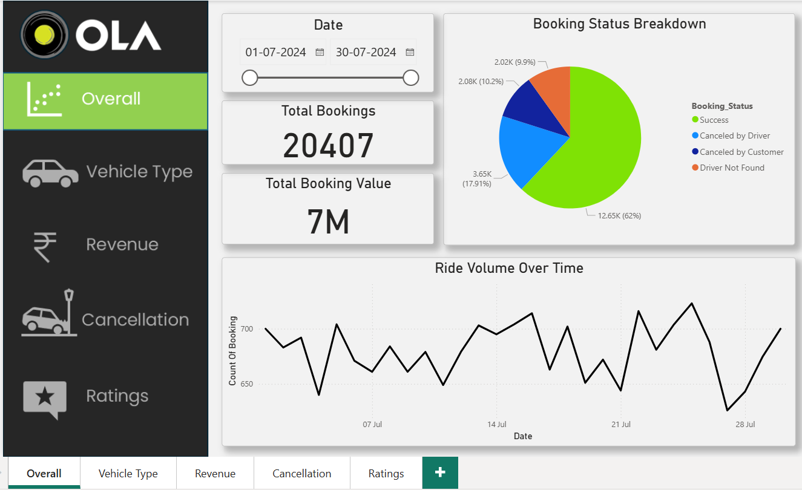
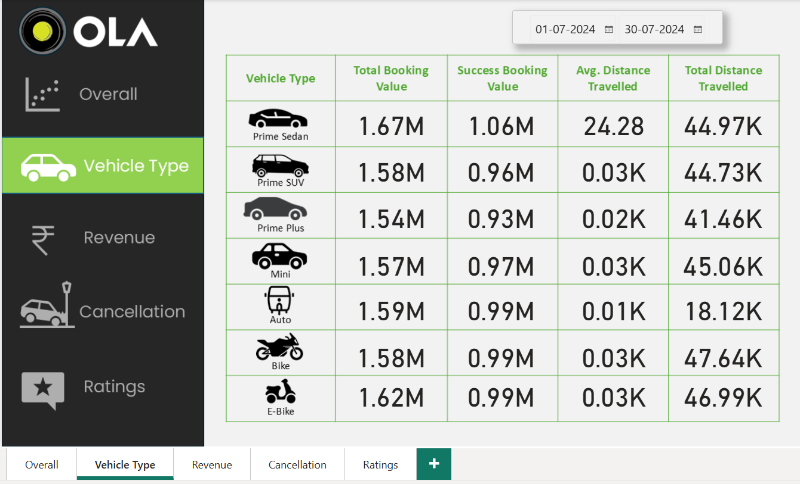
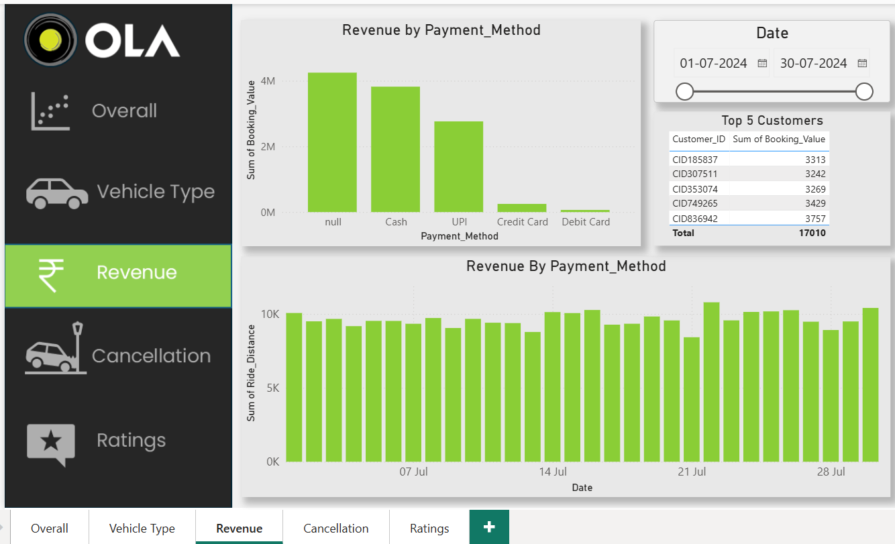
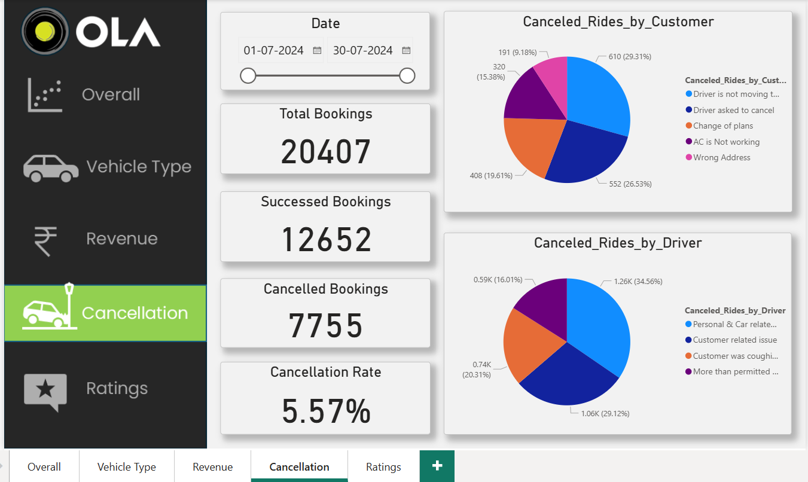
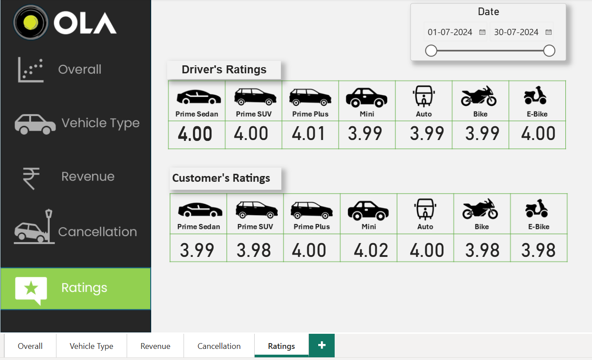

# 🚖 Ola Ride-Sharing Data Analytics Dashboard

This project showcases a complete data analytics workflow using SQL for data extraction, Excel for analysis, and Power BI for building a dynamic dashboard that uncovers key insights from Ola ride-sharing data.

---

## 🎯 Project Objective

To analyze large-scale ride-sharing data and provide actionable insights through an interactive dashboard, helping business stakeholders understand trends, rider behavior, revenue, and performance across different cities and time frames.

---

## 🛠️ Tech Stack

- **SQL** – Data cleaning, joins, and transformation
- **Excel** – Pivot tables, aggregation, and advanced formulas for analysis
- **Power BI** – Visualization and dashboard creation

---

## 📊 Key Features

- Aggregates total trips, revenue, and active users across different time periods.
- Filters by city, vehicle category, customer type, and payment method.
- Shows trends in peak hour bookings, cancellations, and distance traveled.
- Combines insights from SQL and Excel into a centralized, interactive Power BI dashboard.
- Enables business teams to make informed decisions based on clean and visualized data.

---

## 📸 Screenshots

> Make sure to save the following screenshots in a folder called `screenshots/`

### 1. Dashboard Overview  

### 2. Trip Details  

### 3. Revenue Trend  

### 4. City-wise Breakdown  

### 5. Filter View Example  

---
